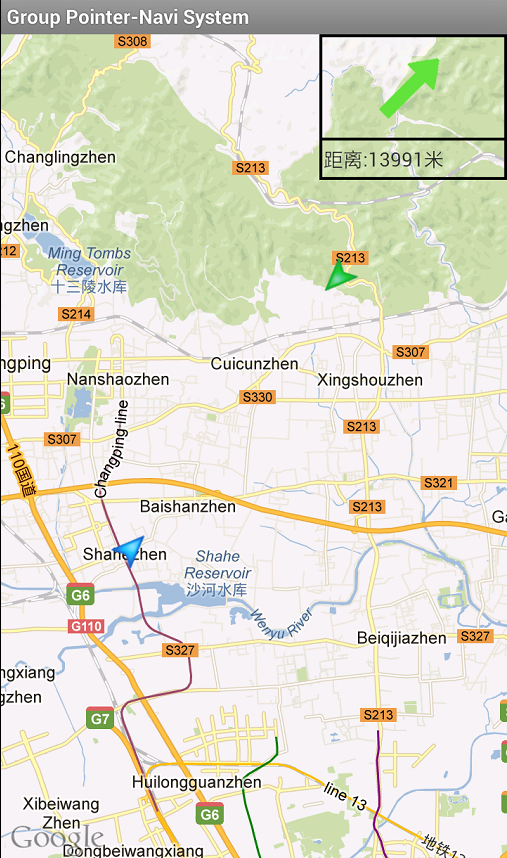
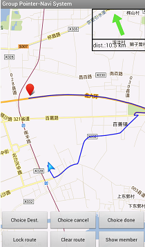

# Medium_07_Navigation
2013 年校级科研项目

# 关于

自21世纪以来，随着全球经济的深入发展，世界各国城市（尤其是大城市）的人口和车辆持续增长，由于交通拥挤而造成的损失随之逐年增加。加之城市居民人均车辆保有量的急速增长，如何协调好快速增长的车辆保有量与交通拥堵的平衡成为阻碍城市化进程的首要难题，由此ITS（Intelligent Transportation System，智能交通系统）的提出顺应了现今人们迫切需要解决交通拥堵问题的期望。本项目按照Android平台软件开发标准对该模块进行了移动导航系统的分析与设计，实现了用户注册登录模块、定位模块和导航模块。用户从服务器获取信息（包括获取好友动态信息，我的好友，以及位置信息等），向服务器发送信息。

# 系统效果

